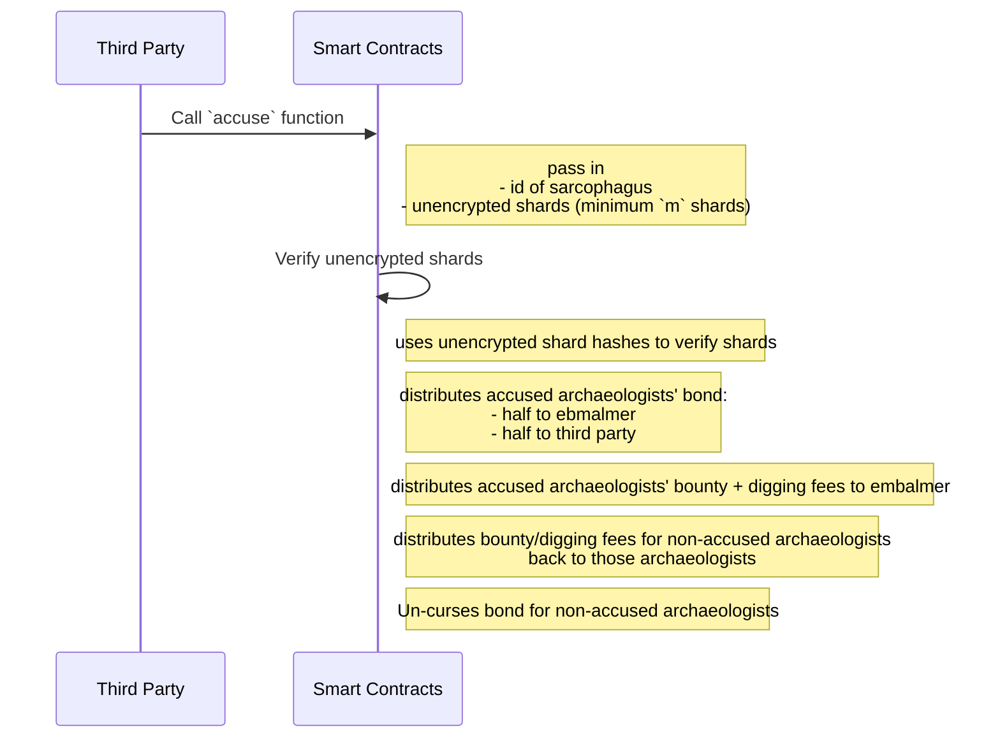

```mermaid
sequenceDiagram
  participant Third Party
  participant Smart Contracts

  Third Party->>Smart Contracts: Call `accuse` function

  Note right of Smart Contracts: pass in<br/>- id of sarcophagus <br/>- unencrypted shards (minimum `m` shards)
  
  Smart Contracts->>Smart Contracts: Verify unencrypted shards
  Note right of Smart Contracts: uses unencrypted shard hashes to verify shards
  Note right of Smart Contracts: distributes accused archaeologists' bond: <br/>- half to ebmalmer<br/>- half to third party
  Note right of Smart Contracts: distributes accused archaeologists' bounty + digging fees to embalmer
  Note right of Smart Contracts: distributes bounty/digging fees for non-accused archaeologists <br/> back to those archaeologists
  Note right of Smart Contracts: Un-curses bond for non-accused archaeologists
```