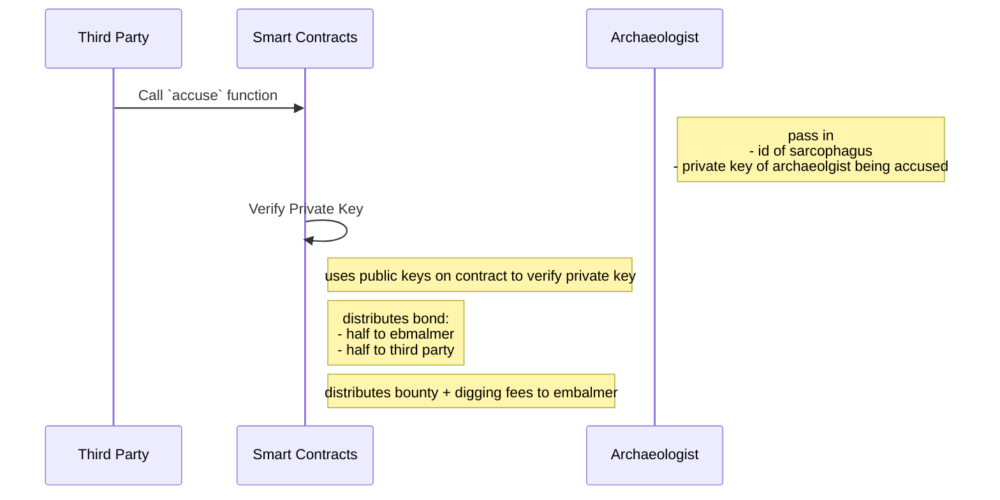

```mermaid
sequenceDiagram
  participant Third Party
  participant Smart Contracts

  Third Party->>Smart Contracts: Call `accuse` function

  Note right of Archaeologist: pass in<br/>- id of sarcophagus <br/>- private key of archaeolgist being accused
  
  Smart Contracts->>Smart Contracts: Verify Private Key
  Note right of Smart Contracts: uses public keys on contract to verify private key
  Note right of Smart Contracts: distributes bond: <br/>- half to ebmalmer<br/>- half to third party
  Note right of Smart Contracts: distributes bounty + digging fees to embalmer
```