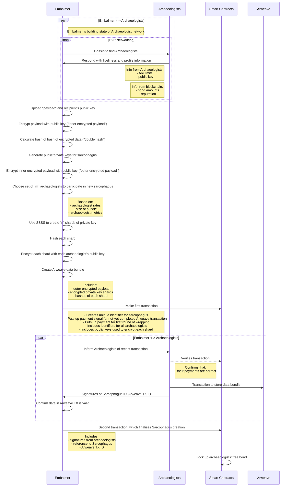

```mermaid
sequenceDiagram
  participant Embalmer
  participant Archaeologists
  participant Smart Contracts
  participant Arweave

  par Embalmer <-> Archaeologists
    Note right of Embalmer: Embalmer is building state of Archaeologist network

    loop P2P Networking
      Embalmer->>Archaeologists: Gossip to find Archaeologists

      Archaeologists->>Embalmer: Respond with liveliness and profile information

      Note left of Archaeologists: Info from Archaeologists:<br/>- fee limits<br/>- public key

      Note left of Archaeologists: Info from blockchain:<br/>- bond amounts<br/>- reputation
    end
  end

  Embalmer->>Embalmer: Upload "payload" and recipient's public key

  Embalmer->>Embalmer: Encrypt payload with public key ("inner encrypted payload")

  Embalmer->>Embalmer: Calculate hash of hash of encrypted data ("double hash")

  Embalmer->>Embalmer: Generate public/private keys for sarcophagus

  Embalmer->>Embalmer: Encrypt inner encrypted payload with public key ("outer encrypted payload")

  Embalmer->>Embalmer: Choose set of `m` archaeologists to participate in new sarcophagus
  
  Note right of Embalmer: Based on:<br/>- archaeologist rates<br/>- size of bundle<br />- archaeologist metrics

  Embalmer->>Embalmer: Use SSSS to create `n` shards of private key

  Embalmer->>Embalmer: Hash each shard

  Embalmer->>Embalmer: Encrypt each shard with each archaeologist's public key

  Embalmer->>Embalmer: Create Arweave data bundle

  Note right of Embalmer: Includes:<br/>- outer encrypted payload<br/>- encrypted private key shards<br/>- hashes of each shard

  Embalmer->>Smart Contracts: Make first transaction

  Note right of Embalmer:- Creates unique identifier for sarcophagus<br/>- Puts up payment signal for not-yet-completed Arweave transaction<br/>- Puts up payment for first round of wrapping<br/>- Includes identifiers for all archaeologists<br/>- Includes public keys used to encrypt each shard

  par Embalmer <-> Archaeologists
    Embalmer->>Archaeologists: Inform Archaeologists of recent transaction

    Archaeologists-->>Smart Contracts: Verifies transaction

    Note right of Archaeologists: Confirms that:<br/>- their payments are correct<br/>
    
    Archaeologists->>Arweave: Transaction to store data bundle

    Archaeologists->>Embalmer: Signatures of Sarcophagus ID, Arweave TX ID
    
    Embalmer->>Embalmer: Confirm data in Arweave TX is valid
  end

  Embalmer->>Smart Contracts: Second transaction, which finalizes Sarcophagus creation

  Note right of Embalmer: Includes:<br/>- signatures from archaeologists<br/>- reference to Sarcophagus<br/>- Arweave TX ID
  
  Smart Contracts->>Smart Contracts: Lock up archaeologists' free bond
```
