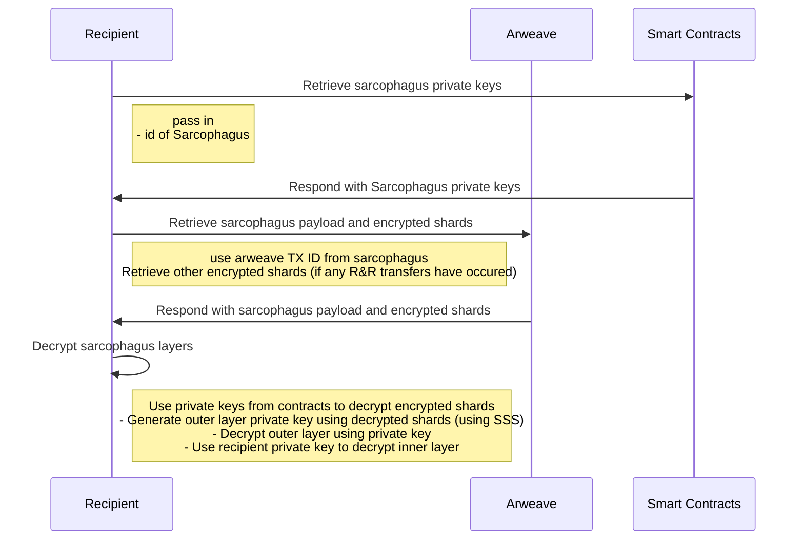

```mermaid
sequenceDiagram
  participant Recipient
  participant Arweave
  participant Smart Contracts

  Recipient->>Smart Contracts: Retrieve sarcophagus private keys

  Note right of Recipient: pass in<br/>- id of Sarcophagus<br/>
  
  Smart Contracts->>Recipient: Respond with Sarcophagus private keys

  Recipient->>Arweave: Retrieve sarcophagus payload and encrypted shards
  
  Note right of Recipient: use arweave TX ID from sarcophagus <br/> Retrieve other encrypted shards (if any R&R transfers have occured)
    
  Arweave->>Recipient: Respond with sarcophagus payload and encrypted shards
  
  Recipient->>Recipient: Decrypt sarcophagus layers

  Note right of Recipient: Use private keys from contracts to decrypt encrypted shards<br>- Generate outer layer private key using decrypted shards (using SSS)<br>- Decrypt outer layer using private key <br/>- Use recipient private key to decrypt inner layer 
```