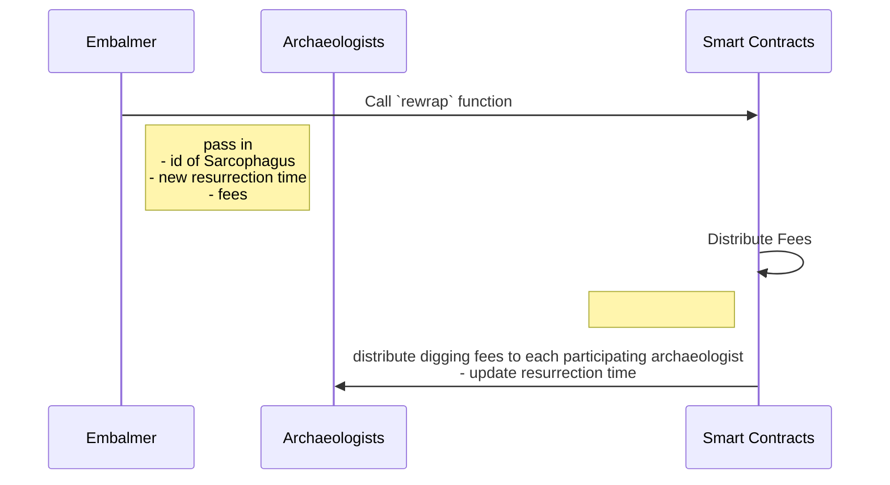

```mermaid
sequenceDiagram
  participant Embalmer
  participant Archaeologists
  participant Smart Contracts

  Embalmer->>Smart Contracts: Call `rewrap` function

  Note right of Embalmer: pass in<br/>- id of Sarcophagus<br/>- new resurrection time<br/>- fees

  Smart Contracts->>Smart Contracts: Distribute Fees

  Note left of Smart Contracts: 

  Smart Contracts->>Archaeologists: distribute digging fees to each participating archaeologist<br/>- update resurrection time
```