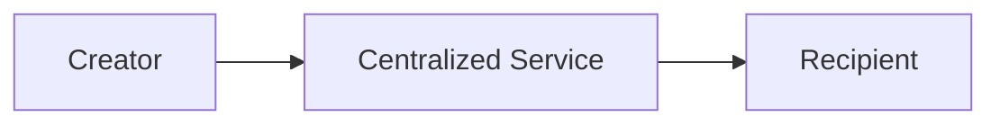
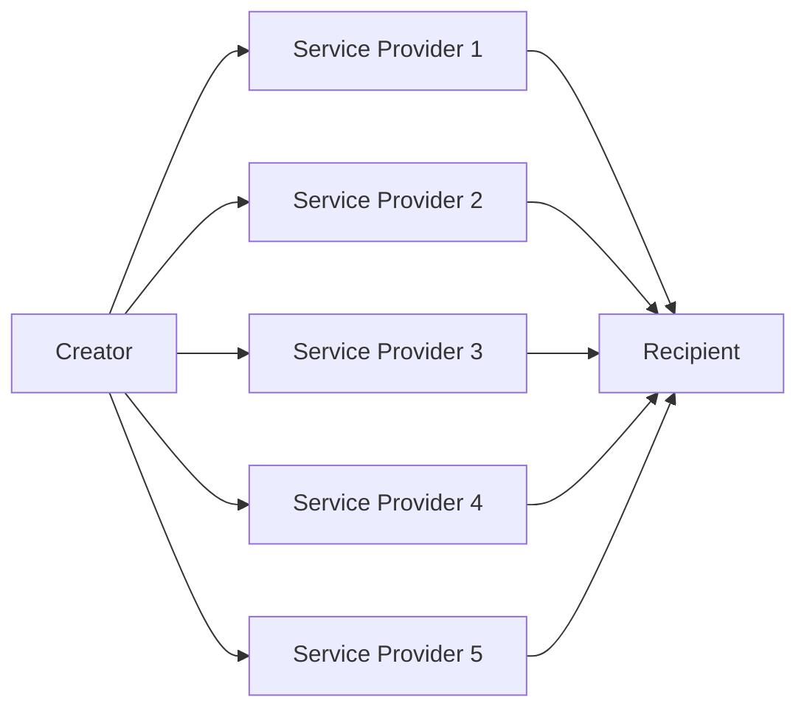

# Sarcophagus System Requirements Specification

## Front Matter

| Key         | Value                        |
| ----------- | ---------------------------- |
| Author(s)   | Adam Gall                    |
| Team(s)     | Sarcophagus DAO x Decent DAO |
| Reviewer(s) | n/a                          |
| Created     | 2022-04                      |
| Updated     | 2022-04-18                   |

## Introduction

### Overview, Problem Description, Summary, or Abstract

Sarcophagus is a system that allows for the creation, management, and eventual execution of a digital [Dead Man's Switch](https://en.wikipedia.org/wiki/Dead_man%27s_switch) (DMS), in a decentralized environment.

The format of a DMS in Sarcophagus is quite simple: a user has "data", in the form of a computer file, that they want a recipient to receive, at the moment in time in which the DMS timeout has elapsed. The creator is always able to extend the DMS time, and may do so indefinitely.

In traditional digital Dead Man's Switch systems, a centralized third party is necessary to sit in between the creator and the recipient.

traditional Dead Man's Switch system architecture

The creator gives their file to the centralized service, who keeps it private and secure until the time which it's necessary to release that file to the recipient.

This works fine until the centralized service does what we're expecting it to do. As soon as it goes offline, or the company shuts down, or they're persuaded by the recipient or other 3 letter organizations to give up the data early, the resiliency of the system breaks down.

In contrast, the Sarcophagus DMS system replaces the centralized service with an array of independent, pseudonymous, profit-motivated actors. These actors, in aggregate, provide the same service as the centralized service in our first example, but do so in a way that increases resiliency of the system two-fold

1. No one (or small set) of actors have enough data to do any harm on their own (harm being, releasing, through neglect or coersion, the payload early).
2. Only a majority of (but not all) actors are necessary in order to provide services at the time of DMS execution (meaning a subset of actors can be offline, but services can still be rendered).

simplified Sarcophagus Dead Man's Switch system architecture

### Glossary or Terminology

- New terms you come across as you research your design or terms you may suspect your readers/stakeholders not to know.

| term                                  | definition                                                                                                                                                                                                         |
| ------------------------------------- | ------------------------------------------------------------------------------------------------------------------------------------------------------------------------------------------------------------------ |
| Sarcophagus (capital "S")             | The name of the system as a whole.                                                                                                                                                                                 |
| sarcophagus (lowercase "s")           | One instance of a Dead Man's Switch.    
| sarcophagi                            | Multiple instances of a Dead Man's Switch.  |
| embalmer                              | The creator of a sarcophagus, who has data they want released to a recipient in the future.                                                                                                                        |
| recipient                             | The entity who is at the receiving end of a sarcophagus. The inner layer of a payload is encrypted with the recipient's public key.                                                                                |
| archaeologist                         | The service provider for a sarcophagus. Each sarcophagus has multiple archaeologists, who are chosen at creation time and keep secrets until unwrapping time.                                                                         |
| payload                               | The data that an embalmer wants their recipient to receive at the time of the DMS triggering.                                                                                                                      |
| rewrap                                | The term for "pinging" a sarcophagus, which keeps it alive and defers the DMS trigger.                                                                                                                             |
| unwrap                                | The term for the actions that archaeologists take when a DMS is triggered. Once the required threshold of archaeologists have called unwrap on a function successfully, this results in anyone being able to decrypt the outer layer of the sarcophagus.
| free bond                             | The amount of SARCO tokens that are available for the system to "bond" for an archaeologist, in order for that archaeologist to accept new sarcophagus jobs.                                                       |
| cursed bond                           | The amount of SARCO tokens that have been "bonded" into the system from an archaeologist, representing the collateral of all sarcophagus jobs.                                                                     |
| bounty                                | The SARCO rewarded to archaeologists when a DMS is triggered and archaeologists complete their job.                                                                                                                |
| digging fee                           | The SARCO rewarded to archaeologists at every rewrap event.                                                                                                                                                        |
| minimum digging fee                   | A parameter set by individual archaeologists, indicating the minimum digging fee they'll accept to participate in a sarcophagus.                                                                                   |
| resurrection time                     | The absolute time at which the sarcophagus DMS must be rewrapped, else it's eligible for unwrapping.                                                                                                               |
| maximum resurrection time             | A parameter set by individual archaeologists, indicating the time in the future that they'll accept sarcophagus jobs with resurrection times.                                                                      |
| Shamir's Secret Sharing Scheme (SSSS) | A cryptographic scheme used to take arbitrary raw data, and split it up into `n` shards, any `m` of which can be combined to re-create the original data.                                                          |
| rights & responsibilities (R&R)       | Refers to an archaeologist's responsibilities (uptime and liveliness at the time of DMS triggering) and the rights they receive because of those responsibilities (digging fee and bounty payments).               |
| inner layer                           | The first layer of encryption that a payload undergoes, using the recipient's public key as the encryption key.                                                                                                    |
| outer layer                           | The second layer of encryption that a payload (at this point, already encrypted once) undergoes, using a freshly created public key (by the embalmer). The resulting blob of this encryption is stored on Arweave. |
| double hash                           | The hash of the hash of the inner layer blob.             
| resurrection                          | The process of decrypting both layers of the sarcophagus to retrieve the payload (done by the recipient)    |

### Context or Background

- Reasons why the problem is worth solving
- Origin of the problem
- How the problem affects users and company goals
- Past efforts made to solve the solution and why they were not effective
- How the product relates to team goals, OKRs
- How the solution fits into the overall product roadmap and strategy
- How the solution fits into the technical strategy

TODO: Would love some help with this section, maybe from @sarcophagusio, @moondog, or @USCMig.

### Goals or Product and Technical Requirements

**User Stories:**

#### As an Embalmer

1. As an embalmer, I want to see the statistics and reputations of archaeologists, so that I can make educated tradeoff decisions on which archaeologists I use for my Dead Man's Switch instances.
1. As an embalmer, I want to create a new Dead Man's Switch instance, so that my family gets access to my seed phrase when I die.
1. As an embalmer, I want to poke my Dead Man's Switch every month, so that my seed phrase isn't accidentally released early.
1. As an embalmer, I want to effectively "end" a Dead Man's Switch I've previously created, so that the recipient will never get access to the data.

#### As an Archaeologist

1. As an archaeologist, I want to set my own profile variables, including fee limits and resurrection limits, so that I can control my profit margins.
1. As an archaeologist, I want to be selected for new Dead Man's Switch instances, so that I can make money with my spare hardware.
1. As an archaeologist, I want to transfer my existing Dead Man's Switch rights & responsibilities, so that I can turn off my hardware for good.
1. As an archaeologist, I want to submit my Dead Man's Switch instances' private key when that Dead Man's Switch is triggered, so that I can receive the bounty payout and increase my reputation.

#### As a Recipient

1. As a recipient, I want to easily know what my Ethereum "public key" is and share it with an embalmer, so that I can be sure that I'll be able to access data on Dead Man's Switches that I'm the recipient of.
1. As a recipient, I want to know when data is available for me, so that I can get access to the private data an embalmer wanted me to have.

#### As a Third Party

1. As a third party, I want to prove to the system that an archaeologist has misbehaved, so that I can make some extra money.

### Future Goals

- Embalmer can change the set of archaeologists when rewrapping a sarcophagus.
- Deploy the contracts on alternate Layer 1s or Layer 2s, and update the archaeologist to be compatible with these alternate networks.
- Establish a marketplace for sarcophagi to be transferred between archaeologists.
- Finding alternate ways to get data to arweave without relying on the archaeologist.

### Assumptions

- A robust network of archaeologists needs to be present for this system to work as intended. 
- Different parties are able to acquire the necessary tokens in order to use the system: ETH, SARCO, AR

## Solutions

### Current or Existing Solution / Design

The current solution can be visualized in the diagrams below.

[Create Sarcophagus](v1/create-sarcophagus.md) 
[Rewrap Sarcophagus](v1/rewrap-sarcophagus.md) 
[Unwrap Sarcophagus](v1/unwrap-sarcophagus.md) 
[Resurrect Sarcophagus](v1/resurrect-sarcophagus.md) 
[Register Archaeologist](v1/register-archaeologist.md) 
[Accuse Archaeologist](v1/accuse-archaeologist.md)

#### Current System Overview
Please see the [V1 litepaper](https://sarcophagus.io/assets/pdf/sarcophagus_litepaper_v0.2.pdf) for overview of v1.

#### Current System Notes

1. The [Sarcophagus Lifecycle](sarcophagus-lifecycle.md) diagram is relevant for both current solution and the proposed new design.
2. The embalmer can interact with archaeologists and the contracts through a web application. This web application is not required for interaction, but provides a user interface to do so.
3. The archaeologist is a service that is intended to run on a server and require minimal maintenance.
4. Archaeologists are incentivized to complete their duties through the following mechanisms:
    - Every time a rewrap occurs on a sarcophagus, the archaeologist will receive payment in the form of digging fees
    - When an archaeologist performs an unwrapping on a sarcophagus, they receive payment in the form of a bounty
    - The archaeologist must post free bond in form of SARCO in order to be assigned to sarcophagi. 
    - When an archaeologist is assigned to a sarcophagi, a portion of their free bond (equal to the digging fees + bounty) become "cursed". They must have at minimum this amount of SARCO in free bond in order to be assigned to the sarcophagus.
    - If the archaeologist fails to complete their duties and unwrap the sarcophagus, this cursed bond will remain locked. If a third party calls "clean sarcophagus", the cursed bond will be distributed between embalmer and third party
    - If a third party successfully accuses an Archaeologist on a sarcophagus, the cursed bond will be distributed between embalmer and third party
5. Archaeologists have reputation metrics stored on-chain:
    - number of successful unwraps
    - number of times successfully accused
    - number of unsuccessful unwraps ("cleaned sarcophagi")
    - number of sarcophagi cancels

#### Current solution pros/cons

**Pros**
- The current solution solves the core problem -- the lifecycle of a sarcophagus works as intended provided the archaeologist does their job (and there are archaeologists available to perform jobs).

**Cons**
- The current solution has a single point of failure for any sarcophagus -- the archaeologist selected for the sarcophagus.
- The archaeologist service is time-consuming and complicated to setup, and requires an HTTP server for communication with embalmers.
- An archaeologist can change their bounty + digging fees for a sarcophagus *after* a sarcophagus has been created. This can result in a sarcophagus becoming too expensive to rewrap for an embalmer.

### Proposed Solution / Design

The new design can be visualized in the diagrams below  
[Sarcophagus Lifecycle](sarcophagus-lifecycle.md) 
[Create Sarcophagus](create-sarcophagus.md) 
[Rewrap Sarcophagus](rewrap-sarcophagus.md) 
[Unwrap Sarcophagus](unwrap-sarcophagus.md) 
[Resurrect Sarcophagus](resurrect-sarcophagus.md) 
[Transfer Archaeologist R&R](transfer-sarcophagus-rights-and-responsibilities.md) 
[Accuse Archaeologist](accuse-archaeologist.md)

#### Proposed Solution Overview
**Mummification Phase**
1. The initial setup of mummification will remain the same as v1:
   - The embalmer will select a payload and use the recipient's public key to encrypt the payload (create the inner layer).
   - The double hash will be generated, to be used as the sarcophagus ID.
   - The embalmer will select a resurrection time.
2. Instead of using the archaeologist's public key to create the outer layer, the embalmer will:
    - Generate a new private / public key pair.
    - Encrypt the inner layer with the public key from this key pair.
3. SSS will be used to shard the private key from the key pair generated in step 2.
   - The embalmer must indicate both `m` and `n`, where:
     - `n`: How many total archaeologists will participate in the sarcophagus.
     - `m`: How many archaeologists are necessary to successfully reveal the secret (the private key).
   - The embalmer will use public keys from each participating archaeologist to encrypt the `n` private key shards.
4. To retrieve the archaeologists' public keys in step 3, as well as other archaeologist communication, the embalmer will use libp2p (see next _Proposed solution notes_ section below for more details).
5. After the embalmer has encrypted each private key shard, an arweave data bundle will be prepared, including:
   - The double-encrypted payload
   - The encrypted private key shards
     - Each shard will have metadata indicating which archaeologist the shard maps to.
   - The hash of each unencrypted shard.
6. The embalmer will create a transaction to initialize the sarcophagus, including:
   - Payment for the sarcophagus (bounty / digging fees).
     - Payment for each archaeologist will be included (as there will be `n` participating archaeologists).
     - The archaeologists will provide their payment info to the embalmer using libp2p.
   - Payment for upcoming arweave TX.
   - Participating archaeologists' public keys.
   - Participating archaeologists' addresses.
7. Once the TX in previous step is successful, the embalmer will send each archaeologist the TX ID (and potentially other participating archaeologist identifiers).
   - Each archaeologist will confirm that the payment posted is sufficient.
   - Either one or all of the participating archaeologists will be responsible for uploading this data bundle to arweave (this is TBD) and sending this arweave TX ID(s) to the embalmer.
   - Each archaeologist will send a signature to the embalmer (signalling that they accept the R&R for this sarcophagus)
8. The embalmer validates the data bundle uploaded to arweave is correct.
9. The embalmer creates a second transaction to finalize the Sarcophagus, including:
   - The signatures from the archaeologists
   - Sarcophagus ID (double hash)
   - Arweave TX ID
10. Once this second TX is successful, the sarcophagus mummification process is complete and the sarcophagus will be in a "pending" state.

**Re-wrapping**
To rewrap, the embalmer will create a transaction that will:

1. Specify a new resurrection time.
2. Pay the archaeologists' their digging fees.

**Unwrapping**
At the time of resurrection:
1. Each participating archaeologist may unwrap the sarcophagus with the relevant private key.
   - The associated public key is the one used to generate the archaeologist's encrypted shard (part of the arweave data bundle).
   - The smart contract can validate this private key using the public key which has been stored on-chain for this sarcophagus.
   - The smart contract will pay the archaeologist the bounty for completing their R&R.

**Resurrection**
If sufficient (`m of n`) archaeologists have participated in the unwrapping, the sarcophagus can be resurrected.

To resurrect the sarcophagus, the recipient will:
1. Download the arweave data bundle using the arweave TX ID stored on the sarcophagus.
2. Decrypt the outer layer:
   - Retrieve the archaeologists' private keys from the sarcophagus
   - Retrieve the encrypted shards from the arweave bundle
   - Decrypt the encrypted shards to reveal the private key
   - Use this private key to reveal the inner layer
3. Decrypt the inner layer
   - Use their private key to decrypt the inner layer
   - Download the fully decrypted payload

**Cancelling, Burying, Cleaning**
These methods will function _almost_ the same as in v1. The only difference will be any fees or bond that would be 
distributed to a single archaeologist in v1 will now be distributed to all participating archaeologists (since multiple will be assigned to a given sarcophagus).

**Accusal**
Accusal will work the same as in v1, with one notable difference: in v1 if an archaeologist was successfully accused, the sarcophagus would enter a "completed" state, 
meaning the sarcophagus could no longer be unwrapped (since the archaeologist should not receive a bounty since they leaked their secret).

However, in v2:
- A single archaeologist leaking their secret does not necessarily compromise the entire sarcophagus
- There are other archaeologists that could still perform their duties (and have not leaked their secret)

As such, unless all participating archaeologists have leaked their secrets, the sarcophagus will remain in a `pending` state and can still be unwrapped at the time of resurrection.

If an archaeologist has been successfully accused, they will not receive their bounty payout if they attempt to `unwrap`. Otherwise they will receive their bounty. 

#### Proposed solution notes
The new proposed solution adds a few core functionality updates which are described below.

**Multiple Archaeologists per Sarcophagus**
1. To avoid having an archaeologist be a single point of failure for any given sarcophagus, multiple archaeologists need to be assigned per sarcophagus.
1. In order to accommodate this change, the following updates are made:
    - The embalmer will now generate the key pair used for encrypting/decrypting the outer layer
    - SSS will be used to split up the embalmer's private key
    - The number of SSS shards will be determined by how many archaeologists are assigned to the sarcophagus
    - For each archaeologist, their public key will be used to encrypt one of the shards that make up the embalmer's private key
    - The archaeologists' private keys will be stored on-chain at the time of unwrapping, and can then be used to reconstruct the embalmer's private key from the encrypted shards
1. Some extra data will be stored on arweave in addition to the payload --- the encrypted shards and the unencrypted shard hashes (used to validate unencrypted shards)
1. The number of shards needed to recreate the secret (private key) in SSS is `m of n`. For example, this could be 3 of 5, meaning the embalmer could require 3 of 5 archaeologists must successfully unwrap for the secret to be reconstructed.

By implementing the above steps, no single archaeologist will be responsible for a sarcophagus failing to be resurrected b/c an archaeologist has not successfully done their unwrapping responsibility. _Note: unless `m = n` for the `m of n` required to reconstruct the secret._

This will increase the likelihood a sarcophagus can be resurrected once an embalmer has failed to attest.

**Transfer Archaeologist Rights and Responsibilities**
1. If an archaeologist wants/needs to shut down their service, they should be able to transfer their R&R for any sarcophagi they are assigned to.
1. By allowing these transfers, this will increase the likelihood a sarcophagus can be resurrected even if the original archaeologist cannot fulfill their duties on a sarcophagus.

Reference this [diagram](transfer-sarcophagus-rights-and-responsibilities.md) to understand mechanisms of this update. 

There will need to be a way for archaeologists to view sarcophagi available for transferring, and a way to signal that they are open to accept transfers.

**Archaeologist Service Upgrades**
1. The new service will be written in NodeJS, as the JS ecosystem has robust tooling and a large set of developers.
1. Archaeologists will no longer use http for communication, and will instead be using a peer-to-peer network. [libp2p](https://libp2p.io) (specifically the javascript implementation), is the framework chosen for implementing the p2p network
    - Any communication that happens between embalmers->archaeologists or archaeologists->archaeologists will take place over libp2p.
    - This will allow for simpler setup of the archaeologist service, since no http server or domain will be required
1. The setup of the archaeologist service will be streamlined and automated
    - The process should be simplified to lower the barrier to entry for archaeologists to join the network

**Static Archaeologist Fees per Sarcophagus**
1. Once a Sarcophagus is created, the digging fees and bounty will be "locked" for the duration of the Sarcophagus
    - Previously, an archaeologist could change their fees between re-wrappings. This is not ideal, as the archaeologist could spike their fees between rewrappings, leading to the embalmer not wanting to rewrap

**Sarcophagus NFT**  
An archaeologist's R&R for a sarcophagus can be represented by an NFT. This NFT could be viewed/displayed by the archaeologist along with various relevant data, such as:
- Resurrection time
- Fees accrued by the archaeologist on the sarcophagus to date

The only potential downside of adding this NFT would be the minting costs associated.

_Notes_
1. Each sarcophagus would have NFTs minted for each archaeologist assigned to the sarcophagus.
1. The owner of this NFT will be the address that is paid for performing archaeologist duties (digging fees & bounty).
1. This NFT would be transferred during the R&R transfer process.

**Web Application**  
The web application will have updated functionality on the front-end:
1. Step to generate key pair for inner-layer encryption
2. Ability to select multiple archaeologists
3. Updated arweave upload functionality to support retries
4. Various other improvements

The web application's mummification process can be improved:
- Instead of using a long vertical form, another option would be to present the form in a linear step-by-step fashion, where only one step is presented to the user.
- This would allow the use of larger fonts and more verbose descriptions, leading to an easier-to-understand and smoother UX for embalmers.

In v1, if an arweave upload fails (due to transaction fees being too low or otherwise), the embalmer would have to cancel (or abandon) the sarcophagus.
In v2, embalmers will be able to retry the arweave upload. This should result in a larger percentage of successful mummifications. 

In v1, sarcophagi for embalmers in the web app are organized based on their state on-chain (pending / completed / cancelled / etc).
In v2, The web app can potentially take advantage of local storage and allow embalmers to further organize their sarcophagi. For example, they may want to archive any cancelled sarcophagi.

### Test Plan

There are 3 participants in the system which need to have test plans.

Below is a list of these participants, and a general outline of test plans for each.

1. Embalmer (represented by a web application)
    - This will rely mostly on manual testing.
    - This will be done by developers during the development of the web application.
    - Any developers in the greater community will also be invited to help with testing during the development process.
    - Once the web application is ready for beta testing, the community will be involved with testing the beta application, which will be launched on an ethereum testnet.

1. Archaeologist (represented by a NodeJS service)
    - There will be an automated test-suite to test the service
    - There will be a beta-testing phase where the community can beta-test the service and leave feedback

3. Smart Contracts (deployed on ethereum)
    - There will be an automated test suite to test the contracts
    - There will be a beta-testing phase where the community can beta-test the contracts and leave feedback.

There will be a testing->feedback->testing cycle for the beta testing phase. Feedback/bugs will be collected and then implemented/fixed. Once implementation has been completed, a new round of beta testing will begin.

### Monitoring and Alerting Plan

The archaeologist service will have improved logging and alerts built into it. Basic alerting functionality will be added for archaeologists so that archaeologist operators can be alerted when something goes wrong (service shuts down, etc).

The web application will have alerts built in, most likely using a 3rd party tool such as Sentry. There will be targeted places in the code which will flag alerts. This will allow for a shorter debug cycle when errors occur.

### Release / Roll-out and Deployment Plan

1. Like in the current implementation, there will both testnet and mainnet versions of the system.
1. As previously described in the Testing Plan, there will be a beta testing phase on testnet, after which a mainnet version of the system will be deployed.
1. The contracts will be upgradable, so in the event the contracts did need to be upgraded, there is an avenue for that to occur. As in V1, the Sarcophagus DAO will be set as the initial owner of all Sarcophagus contracts.
1. All 3 code bases (web application, archaeologist service, smart contracts) will use tagged releases to indicate the deployment version.

Any core changes to the archaeologist service will result in an alert to the community so that archaeologist operators are aware there is a new release. Automated discord alerts can be setup for this.

Archaeologist operators can also subscribe to github updates on the public archaeologist service repo to know when new releases have occurred.

### Rollback Plan

For the web application, any code reversion can be proposed by anyone in the community, and anyone with push permissions to the main web application branch can roll back the code if necessary.

For the archaeologists, the community will be alerted if a rollback of service code is necessary, and archaeologist operators will be responsible for rolling back code on their individual archaeologists.

## Further Considerations

### Third-party services and platforms considerations

Sentry (or equivalent) is being introduced as a 3rd party solution for logging and alerts. Having a central place for devs to debug front end issues on deployed public versions of the web application will help with debugging feedback cycles.
There should be minimal cost for implementing this, and it's not worth the time to develop a bespoke analog for alert/logging as many robust services already exist that do this well.

The smart contracts, web application and archaeologist service will rely on a number of javascript libraries. The community is invited to comment / leave feedback on any libraries used.

### Cost analysis

The main costs for the system are incurred when making blockchain transactions (both on ethereum and arweave). Different participants will pay transaction fees and system fees at different points in a sarcophagus lifecycle.

The transaction fees will be variable depending on gas prices at the time that transactions are executed. 

Transaction estimates for different transactions (and different gas prices) will be posted for the community once the smart contracts have been completed. An example of a few transactions that incur costs in the system (this is not comprehensive, view the system diagrams to see all transactions):
1. Creating a sarcophagus (both embalmer and archaeologist participate)
1. Rewrapping a sarcophagus (embalmer)
1. Adding free bond (archaeologist)

The hardware for running an archaeologist service should be very low (minimal hardware requirements). For example -- Digital Ocean's $4/month entry-level droplet would be more than enough firepower to run the service.

### Security considerations

The smart contracts will be reviewed by a number of experienced Solidity developers, and the code is open source and able to be reviewed by any developers in the community.

There will be a set number of core maintainers for the public web-app to avoid malicious code being pushed to the web application.

Archaeologists will have a best-practices handbook provided to ensure they keep their keys/mnemonic used by the service safe and secure.

Audits will be run on all codebases to ensure there are no libraries with vulnerabilities being used.

### Privacy considerations

All users in the system can be identified through ethereum addresses. Assuming each user practices sufficient privacy practices for these addresses, then the users can remain essentially anonymous. 

The new peer-to-peer network for archaeologists uses encryption for communication channels.

### Regional considerations

There should be no concerns regarding the regional considerations. 

Resurrection times will be set with UTC.

### Accessibility considerations

The web application will be upgraded to include better accessibility considerations than in the current version.

The archaeologist will also have accessibility taken into account.

### Operational considerations

All code for this project is open-source. Anyone can deploy their own version of the web application to increase redundancy.

### Support considerations

1. When the new version of the system is launched, comprehensive instructions will be released with it. This is meant to educate the community and avoid confusion and unnecessary support requests.
1. There is an active discord server where support requests and bugs can be reported. Any active dev, whether core contributor or member of sarcophagus community can verify the issue and respond.
1. Any issue determined to be a bug in the code can have an issue created on github in the relevant repository. A process will be put in place to address these issues.

## Success Evaluation

### Metrics

Some metrics to capture will be:
1. Average amount of time it takes to setup a new archaeologist
1. Number of archaeologists joining the network at a given interval (week / month / etc)
1. Number of successful Sarcophagi being created (vs. number of sarcophagi that have error during creation)

There will be further work on success metrics as the v2 launch gets closer.

## Work

### Prioritization / Milestones

The order in which pieces of the new system will be completed:
1. Smart Contracts
1. Archaeologist Service
1. Web Application

## Deliberation

### Open Questions

The following items require some research and discussion:

1. Using unencrypted shard hashes / unencrypted shards for sarcophagus creation and unwrapping

- Pros:
    - Reduces complexity by removing need for archaeologist to have separate key pairs for each sarcophagus 
    - Avoid archaeologists being paid their bounty despite potentially uploading an incorrect encrypted shard
    
- Cons:
    - Potentially more expensive

1. Archaeologist Arweave upload
    - It needs to be determined how the data bundle gets uploaded to arweave.
    - Either a single archaeologist could be selected to upload the data bundle, or 5 separate bundles could be uploaded (split the data bundle between the archaeologists)

1. Determining M of N archaeologist limit
    - It needs to be decided what the limits of "N" will be (number of archaeologists on a sarcophagus)

## End Matter

### References

**Github** 
[https://github.com/sarcophagus-org](https://github.com/sarcophagus-org)

**V1 Litepaper** 
[https://sarcophagus.io/assets/pdf/sarcophagus_litepaper_v0.2.pdf](https://sarcophagus.io/assets/pdf/sarcophagus_litepaper_v0.2.pdf)

**Website** 
[https://sarcophagus.io/](https://sarcophagus.io)

