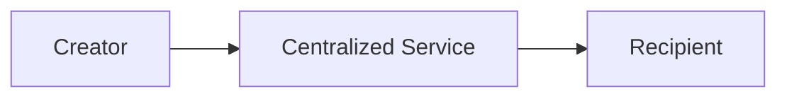
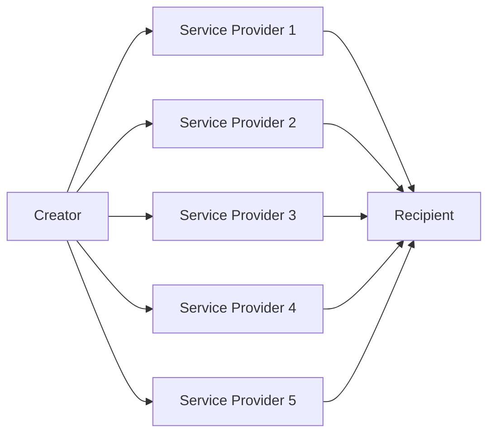

# Sarcophagus System Requirements Specification

## Front Matter

| Key         | Value                        |
| ----------- | ---------------------------- |
| Author(s)   | Adam Gall                    |
| Team(s)     | Sarcophagus DAO x Decent DAO |
| Reviewer(s) | n/a                          |
| Created     | 2022-04                      |
| Updated     | 2022-04-18                   |

## Introduction

### Overview, Problem Description, Summary, or Abstract

Sarcophagus is a system that allows for the creation, management, and eventual execution of a digital [Dead Man's Switch](https://en.wikipedia.org/wiki/Dead_man%27s_switch) (DMS), in a decentralized environment.

The format of a DMS in Sarcophagus is quite simple: a user has "data", in the form of a computer file, that they want a recipient to receive, at the moment in time in which the DMS timeout has elapsed. The creator is always able to extend the DMS time, and may do so indefinitely.

In traditional digital Dead Man's Switch systems, a centralized third party is necessary to sit in between the creator and the recipient.

traditional Dead Man's Switch system architecture

The creator gives their file to the centralized service, who keeps it private and secure until the time which it's necessary to release that file to the recipient.

This works fine until the centralized service does what we're expecting it to do. As soon as it goes offline, or the company shuts down, or they're persuaded by the recipient or other 3 letter organizations to give up the data early, the resiliency of the system breaks down.

In contrast, the Sarcophagus DMS system replaces the centralized service with an array of independent, pseudonymous, profit-motivated actors. These actors, in aggregate, provide the same service as the centralized service in our first example, but do so in a way that increases resiliency of the system two-fold

1. No one (or small set) of actors have enough data to do any harm on their own (harm being, releasing, through neglect or coersion, the payload early).
2. Only a majority of (but not all) actors are necessary in order to provide services at the time of DMS execution (meaning a subset of actors can be offline, but services can still be rendered).

simplified Sarcophagus Dead Man's Switch system architecture

### Glossary or Terminology

- New terms you come across as you research your design or terms you may suspect your readers/stakeholders not to know.

| term                                  | definition                                                                                                                                                                                                         |
| ------------------------------------- | ------------------------------------------------------------------------------------------------------------------------------------------------------------------------------------------------------------------ |
| Sarcophagus (capital "S")             | The name of the system as a whole.                                                                                                                                                                                 |
| sarcophagus (lowercase "s")           | One instance of a Dead Man's Switch.                                                                                                                                                                               |
| embalmer                              | The creator of a sarcophagus, who has data they want released to a recipient in the future.                                                                                                                        |
| recipient                             | The entity who is at the receiving end of a sarcophagus. The inner layer of a payload is encrypted with the recipient's public key.                                                                                |
| archaeologist                         | The service provider for a sarcophagus. Each sarcophagus has multiple archaeologists, who are chosen at creation time and keep secrets until unwrapping time.                                                                         |
| payload                               | The data that an embalmer wants their recipient to receive at the time of the DMS triggering.                                                                                                                      |
| rewrap                                | The term for "pinging" a sarcophagus, which keeps it alive and defers the DMS trigger.                                                                                                                             |
| unwrap                                | The term for the actions that archaeologists take when a DMS is triggered. Once the required threshold of archaeologists have called unwrap on a function successfully, this results in anyone being able to decrypt the outer layer of the sarcophagus.
| free bond                             | The amount of SARCO tokens that are available for the system to "bond" for an archaeologist, in order for that archaeologist to accept new sarcophagus jobs.                                                       |
| cursed bond                           | The amount of SARCO tokens that have been "bonded" into the system from an archaeologist, representing the collateral of all sarcophagus jobs.                                                                     |
| bounty                                | The SARCO rewarded to archaeologists when a DMS is triggered and archaeologists complete their job.                                                                                                                |
| digging fee                           | The SARCO rewarded to archaeologists at every rewrap event.                                                                                                                                                        |
| minimum digging fee                   | A parameter set by individual archaeologists, indicating the minimum digging fee they'll accept to participate in a sarcophagus.                                                                                   |
| resurrection time                     | The absolute time at which the sarcophagus DMS must be rewrapped, else it's eligible for unwrapping.                                                                                                               |
| maximum resurrection time             | A parameter set by individual archaeologists, indicating the time in the future that they'll accept sarcophagus jobs with resurrection times.                                                                      |
| Shamir's Secret Sharing Scheme (SSSS) | A cryptographic scheme used to take arbitrary raw data, and split it up into `n` shards, any `m` of which can be combined to re-create the original data.                                                          |
| rights & responsibilities (R&R)       | Refers to an archaeologist's responsibilities (uptime and liveliness at the time of DMS triggering) and the rights they receive because of those responsibilities (digging fee and bounty payments).               |
| inner layer                           | The first layer of encryption that a payload undergoes, using the recipient's public key as the encryption key.                                                                                                    |
| outer layer                           | The second layer of encryption that a payload (at this point, already encrypted once) undergoes, using a freshly created public key (by the embalmer). The resulting blob of this encryption is stored on Arweave. |
| double hash                           | The hash of the hash of the inner layer blob.                                                                                                                                                                      |

### Context or Background

- Reasons why the problem is worth solving
- Origin of the problem
- How the problem affects users and company goals
- Past efforts made to solve the solution and why they were not effective
- How the product relates to team goals, OKRs
- How the solution fits into the overall product roadmap and strategy
- How the solution fits into the technical strategy

TODO: Would love some help with this section, maybe from @sarcophagusio, @moondog, or @USCMig.

### Goals or Product and Technical Requirements

- Product requirements in the form of user stories
- Technical requirements

#### As an Embalmer

1. As an embalmer, I want to see the statistics and reputations of archaeologists, so that I can make educated tradeoff decisions on which archaeologists I use for my Dead Man's Switch instances.
1. As an embalmer, I want to create a new Dead Man's Switch instance, so that my family gets access to my seed phrase when I die.
1. As an embalmer, I want to poke my Dead Man's Switch every month, so that my seed phrase isn't accidentally released early.
1. As an embalmer, I want to effectively "end" a Dead Man's Switch I've previously created, so that the recipient will never get access to the data.

#### As an Archaeologist

1. As an archaeologist, I want to set my own profile variables, including fee limits and resurrection limits, so that I can control my profit margins.
1. As an archaeologist, I want to be selected for new Dead Man's Switch instances, so that I can make money with my spare hardware.
1. As an archaeologist, I want to transfer my existing Dead Man's Switch rights & responsibilies, so that I can turn off my hardware for good.
1. As an archaeologist, I want to submit my Dead Man's Switch instances' private key when that Dead Man's Switch is triggered, so that I can receive the bounty payout and increase my reputation.

#### As a Recipient

1. As a recipient, I want to easily know what my Ethereum "public key" is and share it with an embalmer, so that I can be sure that I'll be able to access data on Dead Man's Switches that I'm the recipient of.
1. As a recipient, I want to know when data is available for me, so that I can get access to the private data an embalmer wanted me to have.

#### As a Third Party

1. As a third party, I want to prove to the system that an archaeologist has misbehaved, so that I can make some extra money.

### Non-Goals or Out of Scope

- Product and technical requirements that will be disregarded

### Future Goals

- Embalmer can change the set of archaeologists when rewrapping a sarcophagus.
- Launching the system on alternate Layer 1s or Layer 2s.
- Establish a marketplace for sarcophagi to be transferred between archaeologists.
- Finding alternate ways to get data to arweave without relying on the archaeologist.

### Assumptions

- A robust network of archaeologists needs to be present for this system to work as intended. 
- Different parties are able to acquire the necessary tokens in order to use the system: ETH, SARCO, AR

## Solutions

### Current or Existing Solution / Design

- The current solution and design can be visualized in the diagram below.

1. The embalmer can interact with archaeologists and the contracts through a web application.
1. The archaeologist is a service written in Golang that is meant to run on a server and require minimal maintenance.

- Pros and cons of the current solution

### Suggested or Proposed Solution / Design

- External components that the solution will interact with and that it will alter
- Dependencies of the current solution
- Pros and cons of the proposed solution
- Data Model / Schema Changes
  - Schema definitions
  - New data models
  - Modified data models
  - Data validation methods
- Business Logic
  - API changes
  - Pseudocode
  - Flowcharts
  - Error states
  - Failure scenarios
  - Conditions that lead to errors and failures
  - Limitations
- Presentation Layer
  - User requirements
  - UX changes
  - UI changes
  - Wireframes with descriptions
  - Links to UI/UX designer’s work
  - Mobile concerns
  - Web concerns
  - UI states
  - Error handling
- Other questions to answer
  - How will the solution scale?
  - What are the limitations of the solution?
  - How will it recover in the event of a failure?
  - How will it cope with future requirements?

### Test Plan

- Explanations of how the tests will make sure user requirements are met
- Unit tests
- Integrations tests
- QA

### Monitoring and Alerting Plan

- Logging plan and tools
- Monitoring plan and tools
- Metrics to be used to measure health
- How to ensure observability
- Alerting plan and tools

### Release / Roll-out and Deployment Plan

- Deployment architecture
- Deployment environments
- Phased roll-out plan e.g. using feature flags
- Plan outlining how to communicate changes to the users, for example, with release notes

### Rollback Plan

- Detailed and specific liabilities
- Plan to reduce liabilities
- Plan describing how to prevent other components, services, and systems from being affected

### Alternate Solutions / Designs

- Short summary statement for each alternative solution
- Pros and cons for each alternative
- Reasons why each solution couldn’t work
- Ways in which alternatives were inferior to the proposed solution
- Migration plan to next best alternative in case the proposed solution falls through

## Further Considerations

### Impact on other teams

- How will this increase the work of other people?

### Third-party services and platforms considerations

- Is it really worth it compared to building the service in-house?
- What are some of the security and privacy concerns associated with the services/platforms?
- How much will it cost?
- How will it scale?
- What possible future issues are anticipated?

### Cost analysis

- What is the cost to run the solution per day?
- What does it cost to roll it out?

### Security considerations

- What are the potential threats?
- How will they be mitigated?
- How will the solution affect the security of other components, services, and systems?

### Privacy considerations

- Does the solution follow local laws and legal policies on data privacy?
- How does the solution protect users’ data privacy?
- What are some of the tradeoffs between personalization and privacy in the solution?

### Regional considerations

- What is the impact of internationalization and localization on the solution?
- What are the latency issues?
- What are the legal concerns?
- What is the state of service availability?
- How will data transfer across regions be achieved and what are the concerns here?

### Accessibility considerations

- How accessible is the solution?
- What tools will you use to evaluate its accessibility?

### Operational considerations

- Does this solution cause adverse aftereffects?
- How will data be recovered in case of failure?
- How will the solution recover in case of a failure?
- How will operational costs be kept low while delivering increased value to the users?

### Risks

- What risks are being undertaken with this solution?
- Are there risks that once taken can’t be walked back?
- What is the cost-benefit analysis of taking these risks?

### Support considerations

- How will the support team get across information to users about common issues they may face while interacting with the changes?
- How will we ensure that the users are satisfied with the solution and can interact with it with minimal support?
- Who is responsible for the maintenance of the solution?
- How will knowledge transfer be accomplished if the project owner is unavailable?

## Success Evaluation

### Impact

- Security impact
- Performance impact
- Cost impact
- Impact on other components and services

### Metrics

- List of metrics to capture
- Tools to capture and measure metrics

## Work

### Work estimates and timelines

- List of specific, measurable, and time-bound tasks
- Resources needed to finish each task
- Time estimates for how long each task needs to be completed

### Prioritization

- Categorization of tasks by urgency and impact

### Milestones

- Dated checkpoints when significant chunks of work will have been completed
- Metrics to indicate the passing of the milestone

### Future work

- List of tasks that will be completed in the future

## Deliberation

### Discussion

- Elements of the solution that members of the team do not agree on and need to be debated further to reach a consensus.

### Open Questions

- Questions about things you do not know the answers to or are unsure that you pose to the team and stakeholders for their input. These may include aspects of the problem you don’t know how to resolve yet.

## End Matter

### Related Work

- Any work external to the proposed solution that is similar to it in some way and is worked on by different teams. It’s important to know this to enable knowledge sharing between such teams when faced with related problems.

### References

- Links to documents and resources that you used when coming up with your design and wish to credit.

### Acknowledgments

- Credit people who have contributed to the design that you wish to recognize.
