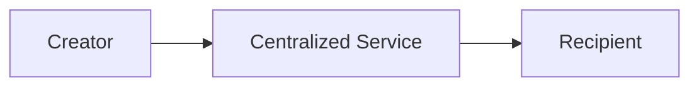
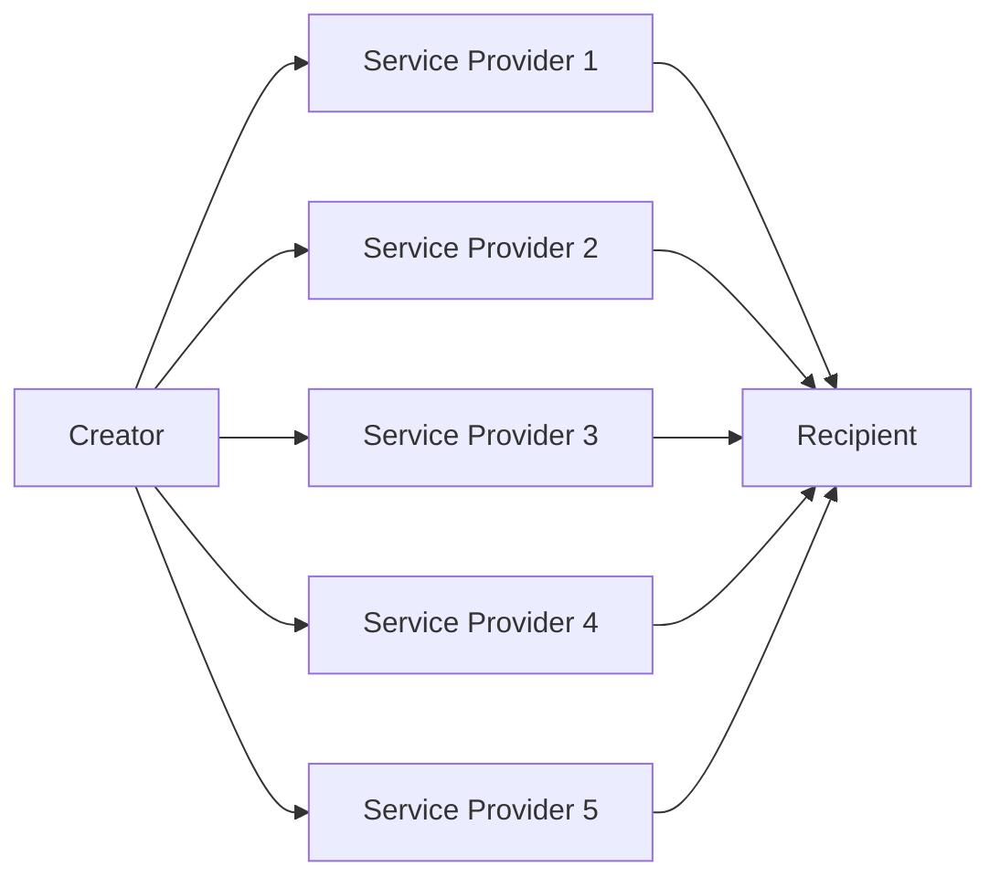

# Sarcophagus System Requirements Specification

## Front Matter

| Key         | Value                        |
| ----------- | ---------------------------- |
| Author(s)   | Adam Gall                    |
| Team(s)     | Sarcophagus DAO x Decent DAO |
| Reviewer(s) | n/a                          |
| Created     | 2022-04                      |
| Updated     | 2022-04-18                   |

## Introduction

### Overview, Problem Description, Summary, or Abstract

Sarcophagus is a system that allows for the creation, management, and eventual execution of a digital [Dead Man's Switch](https://en.wikipedia.org/wiki/Dead_man%27s_switch) (DMS), in a decentralized environment.

The format of a DMS in Sarcophagus is quite simple: a user has "data", in the form of a computer file, that they want a recipient to receive, at the moment in time in which the DMS timeout has elapsed. The creator is always able to extend the DMS time, and may do so indefinitely.

In traditional digital Dead Man's Switch systems, a centralized third party is necessary to sit in between the creator and the recipient.

traditional Dead Man's Switch system architecture

The creator gives their file to the centralized service, who keeps it private and secure until the time which it's necessary to release that file to the recipient.

This works fine until the centralized service does what we're expecting it to do. As soon as it goes offline, or the company shuts down, or they're persuaded by the recipient or other 3 letter organizations to give up the data early, the resiliency of the system breaks down.

In contrast, the Sarcophagus DMS system replaces the centralized service with an array of independent, pseudonymous, profit-motivated actors. These actors, in aggregate, provide the same service as the centralized service in our first example, but do so in a way that increases resiliency of the system two-fold

1. No one (or small set) of actors have enough data to do any harm on their own (harm being, releasing, through neglect or coersion, the payload early).
2. Only a majority of (but not all) actors are necessary in order to provide services at the time of DMS execution (meaning a subset of actors can be offline, but services can still be rendered).

simplified Sarcophagus Dead Man's Switch system architecture

### Glossary or Terminology

- New terms you come across as you research your design or terms you may suspect your readers/stakeholders not to know.

| term                                  | definition                                                                                                                                                                                                         |
| ------------------------------------- | ------------------------------------------------------------------------------------------------------------------------------------------------------------------------------------------------------------------ |
| Sarcophagus (capital "S")             | The name of the system as a whole.                                                                                                                                                                                 |
| sarcophagus (lowercase "s")           | One instance of a Dead Man's Switch.                                                                                                                                                                               |
| embalmer                              | The creator of a sarcophagus, who has data they want released to a recipient in the future.                                                                                                                        |
| recipient                             | The entity who is at the receiving end of a sarcophagus. The inner layer of a payload is encrypted with the recipient's public key.                                                                                |
| archaeologist                         | The service provider for a sarcophagus. Each sarcophagus has multiple archaeologists, who are chosen at creation time and keep secrets until unwrapping time.                                                                         |
| payload                               | The data that an embalmer wants their recipient to receive at the time of the DMS triggering.                                                                                                                      |
| rewrap                                | The term for "pinging" a sarcophagus, which keeps it alive and defers the DMS trigger.                                                                                                                             |
| unwrap                                | The term for the actions that archaeologists take when a DMS is triggered. Once the required threshold of archaeologists have called unwrap on a function successfully, this results in anyone being able to decrypt the outer layer of the sarcophagus.
| free bond                             | The amount of SARCO tokens that are available for the system to "bond" for an archaeologist, in order for that archaeologist to accept new sarcophagus jobs.                                                       |
| cursed bond                           | The amount of SARCO tokens that have been "bonded" into the system from an archaeologist, representing the collateral of all sarcophagus jobs.                                                                     |
| bounty                                | The SARCO rewarded to archaeologists when a DMS is triggered and archaeologists complete their job.                                                                                                                |
| digging fee                           | The SARCO rewarded to archaeologists at every rewrap event.                                                                                                                                                        |
| minimum digging fee                   | A parameter set by individual archaeologists, indicating the minimum digging fee they'll accept to participate in a sarcophagus.                                                                                   |
| resurrection time                     | The absolute time at which the sarcophagus DMS must be rewrapped, else it's eligible for unwrapping.                                                                                                               |
| maximum resurrection time             | A parameter set by individual archaeologists, indicating the time in the future that they'll accept sarcophagus jobs with resurrection times.                                                                      |
| Shamir's Secret Sharing Scheme (SSSS) | A cryptographic scheme used to take arbitrary raw data, and split it up into `n` shards, any `m` of which can be combined to re-create the original data.                                                          |
| rights & responsibilities (R&R)       | Refers to an archaeologist's responsibilities (uptime and liveliness at the time of DMS triggering) and the rights they receive because of those responsibilities (digging fee and bounty payments).               |
| inner layer                           | The first layer of encryption that a payload undergoes, using the recipient's public key as the encryption key.                                                                                                    |
| outer layer                           | The second layer of encryption that a payload (at this point, already encrypted once) undergoes, using a freshly created public key (by the embalmer). The resulting blob of this encryption is stored on Arweave. |
| double hash                           | The hash of the hash of the inner layer blob.             
| exhume                                | The process of decrypting both layers of the sarcophagus to retrieve the payload (done by the recipient)    |

### Context or Background

- Reasons why the problem is worth solving
- Origin of the problem
- How the problem affects users and company goals
- Past efforts made to solve the solution and why they were not effective
- How the product relates to team goals, OKRs
- How the solution fits into the overall product roadmap and strategy
- How the solution fits into the technical strategy

TODO: Would love some help with this section, maybe from @sarcophagusio, @moondog, or @USCMig.

### Goals or Product and Technical Requirements

- Product requirements in the form of user stories
- Technical requirements

#### As an Embalmer

1. As an embalmer, I want to see the statistics and reputations of archaeologists, so that I can make educated tradeoff decisions on which archaeologists I use for my Dead Man's Switch instances.
1. As an embalmer, I want to create a new Dead Man's Switch instance, so that my family gets access to my seed phrase when I die.
1. As an embalmer, I want to poke my Dead Man's Switch every month, so that my seed phrase isn't accidentally released early.
1. As an embalmer, I want to effectively "end" a Dead Man's Switch I've previously created, so that the recipient will never get access to the data.

#### As an Archaeologist

1. As an archaeologist, I want to set my own profile variables, including fee limits and resurrection limits, so that I can control my profit margins.
1. As an archaeologist, I want to be selected for new Dead Man's Switch instances, so that I can make money with my spare hardware.
1. As an archaeologist, I want to transfer my existing Dead Man's Switch rights & responsibilities, so that I can turn off my hardware for good.
1. As an archaeologist, I want to submit my Dead Man's Switch instances' private key when that Dead Man's Switch is triggered, so that I can receive the bounty payout and increase my reputation.

#### As a Recipient

1. As a recipient, I want to easily know what my Ethereum "public key" is and share it with an embalmer, so that I can be sure that I'll be able to access data on Dead Man's Switches that I'm the recipient of.
1. As a recipient, I want to know when data is available for me, so that I can get access to the private data an embalmer wanted me to have.

#### As a Third Party

1. As a third party, I want to prove to the system that an archaeologist has misbehaved, so that I can make some extra money.

### Future Goals

- Embalmer can change the set of archaeologists when rewrapping a sarcophagus.
- Deploy the contracts on alternate Layer 1s or Layer 2s, and update the archaeologist to be compatible with these alternate networks.
- Establish a marketplace for sarcophagi to be transferred between archaeologists.
- Finding alternate ways to get data to arweave without relying on the archaeologist.

### Assumptions

- A robust network of archaeologists needs to be present for this system to work as intended. 
- Different parties are able to acquire the necessary tokens in order to use the system: ETH, SARCO, AR

## Solutions

### Current or Existing Solution / Design

The current solution and design can be visualized in the diagrams below.
[Create Sarcophagus](v1/create-sarcophagus.md)
[Rewrap Sarcophagus](v1/rewrap-sarcophagus.md)
[Unwrap Sarcophagus](v1/unwrap-sarcophagus.md)
[Exhume Sarcophagus](v1/exhume-sarcophagus.md)

#### Current System Notes
1. The [Sarcophagus Lifecycle](sarcophagus-lifecycle.md) diagram is relevant for both current solution and the proposed new design.
2. The embalmer can interact with archaeologists and the contracts through a web application. This web application is not required for interaction, but provides a user interface to do so.
3. The archaeologist is a service written in Golang that is meant to run on a server on "auto-pilot" and require minimal maintenance.

#### Current solution pros/cons
**Pros**
- The current solution solves the core problem. The lifecycle of a sarcophagus works as intended provided the archaeologist does their job.

**Cons**
- The current solution has a single point of failure for any sarcophagus -- the archaeologist selected for the sarcophagus.
- The archaeologist is difficult and time consuming to setup and requires an HTTP server to work.
- An archaeologist can change their bounty + digging fees for a sarcophagus *after* a sarcophagus has been created.

### Proposed Solution / Design

The new design can be visualized in the diagrams below
[Sarcophagus Lifecycle](sarcophagus-lifecycle.md)
[Create Sarcophagus](create-sarcophagus.md)
[Rewrap Sarcophagus](rewrap-sarcophagus.md)
[Unwrap Sarcophagus](unwrap-sarcophagus.md)
[Exhume Sarcophagus](exhume-sarcophagus.md)
[Transfer Archaeologist R&R](transfer-sarcophagus-rights-and-responsibilities.md)

#### Proposed solution updates
The new proposed solution adds a few core functionality updates which are described below.

**Multiple Archaeologists per Sarcophagus**
1. To avoid having an archaeologist be a single point of failure for any given sarcophagus, we want to assign multiple archaeologists per sarcophagus.
1. In order to accommodate this change, the following updates are made:
- The embalmer will now generate the key pair used for encrypting/decrypting the outer layer
- SSS will be used to split up the embalmer's private key
- The number of shards will be determined by how many archaeologists are assigned to the sarcophagus
- For each archaeologist, their public key will be used to encrypt one of the shards that make up the embalmer's private key
- The archaeologist's private keys will be stored on-chain at the time of unwrapping, and can then be used to reconstruct the embalmer's private key from the encrypted shards
3. Some extra data will be stored on arweave in addition to the payload --- the encrypted shards and the unencrypted shard hashes (used to validate unencrypted shards)
4. The number of shards needed to recreate the secret (private key) in SSS is `m of n`. For example, this could be 3 of 5, meaning the embalmer could require 3 of 5 archaeologists must successfully unwrap for the secret to be reconstructed.

By implementing the above steps, no single archaeologist will be responsible for a sarcophagus failing to be exhumed b/c an archaeologist has not successfully done their unwrapping responsibility. _Note: unless `m = n` for the `m of n` required to reconstruct the secret._

This will increase the likelihood a sarcophagus can be exhumed once an embalmer has failed to attest.

**Transfer Archaeologist Rights and Responsibilities**
1. If an archaeologist wants/needs to shut down their service, we want to allow them the opportunity to transfer their R&R for any sarcophagi they are assigned to
2. By allowing these transfers, this will increase the likelihood a sarcophagus can be exhumed even if the original archaeologist cannot fulfill their duties on a sarcophagus

Reference this [diagram](transfer-sarcophagus-rights-and-responsibilities.md) to understand mechanisms of this update. 

We will need a way for archaeologists to view sarcophagi available for transferring, and a way to signal that they are open to accept transfers.

**Archaeologist Service Upgrades**
1. The new service will be written in NodeJS, as we feel the JS ecosystem has more robust tooling and a large set of developers.
2. We will be using a peer-to-peer network for archaeologists. We are proceeding with [libp2p](https://libp2p.io) (specifically the javascript implementation), as the framework for implementing the p2p network
- Any communication that happens between embalmers->archaeologists or archaeologists->archaeologists will take place over libp2p. In current implementation http was used for communication.
- This will allow for simpler setup of the archaeologist service, since no http server or domain will be required
3. The setup of the archaeologist service will be more streamlined and automated
- We want to simplify the setup process to lower the barrier to entry for archaeologists to join the network

**Sarcophagus NFT**
One update we are considering adding, pending extra research:
1. Each sarcophagus can have NFTs minted for each archaeologist assigned to the sarcophagus.
1. The owner of this NFT will be the address that is paid for performing archaeologist duties (digging fees & bounty).

### Test Plan

There are 3 participants in the system which need to have test plans.

Below is a list of these participants, and a general outline of test plans for each.

1. Embalmer (represented by a web application)
- This will rely mostly on manual testing.
- This will be done by developers during the development of the web application.
- Any developers in the greater community will also be invited to help with testing during the development process.
- Once the web application is ready for beta testing, the community will be involved with testing the beta application, which will be launched on an ethereum testnet.

2. Archaeologist (represented by a NodeJS service)
- There will be an automated test-suite to test the service
- There will be a beta-testing phase where the community can beta-test the service and leave feedback

3. Smart Contracts (deployed on ethereum)
- There will be an automated test suite to test the contracts
- There will be a beta-testing phase where the community can beta-test the contracts and leave feedback.

There will be a testing->feedback->testing cycle for the beta testing phase. Feedback/bugs will be collected and then implemented/fixed. Once implementation has been completed, a new round of beta testing will begin.

### Monitoring and Alerting Plan

The archaeologist service will have improved logging and alerts built into it. Basic alerting functionality will be added for archaeologists so that archaeologist operators can be alerted when something goes wrong (service shuts down, etc).

The web application will have alerts built in, most likely using a 3rd party tool such as Sentry. There will be targeted places in the code which will flag alerts. This will allow for a shorter debug cycle when errors occur.

### Release / Roll-out and Deployment Plan

1. Like in the current implementation, there will both testnet and mainnet versions of the system. 
2. As previously described in the Testing Plan, there will be a beta testing phase on testnet, after which a mainnet version of the system will be deployed.
3. The contracts will be upgradable, so in the event the contracts did need to be upgraded, there is an avenue for that to occur.
4. All 3 code bases (web application, archaeologist service, smart contracts) will use tagged releases to indicate the deployment version. 

Any core changes to the archaeologist service will result in an alert to the community so that archaeologist operators are aware there is a new release. This process can be automated when new releases are pushed to push a message to discord.

Archaeologist operators can also subscribe to github updates on the public archaeologist service repo to know when new releases have occurred.

### Rollback Plan

For the web application, any code reversion can be proposed by anyone in the community, and anyone with push permissions to the main web application branch can roll back the code if necessary.

For the archaeologists, the community will be alerted if a rollback of service code is necessary, and archaeologist operators will be responsible for rolling back code on their individual archaeologists.

## Further Considerations

### Third-party services and platforms considerations

Sentry (or equivalent) is being introduced as a 3rd party solution for logging and alerts. Having a central place for devs to debug front end issues on deployed public versions of the web application will help with debugging feedback cycles.
There should be minimal cost for implementing this, and it's not worth the time to develop a bespoke analog for alert/logging as many robust services already exist that do this well.

The smart contracts, web application and archaeologist will rely on a number of javascript libraries. The community is invited to comment on any libraries used.

### Cost analysis

The main costs for the system are incurred when making blockchain transactions (both on ethereum and arweave). Different participants will pay transaction fees and system fees at different points in a sarcophagus lifecycle.

The transaction fees will be variable depending on gas prices at the time that transactions are executed. 

Transaction estimates for different transactions (and different gas prices) will be posted for the community once the smart contracts have been completed. An example of a few transactions that incur costs in the system (this is not comprehensive, view the system diagrams to see all transactions):
1. Creating a sarcophagus (both embalmer and archaeologist participate)
2. Rewrapping a sarcophagus (embalmer)
3. Adding free bond (archaeologist)

The hardware for running an archaeologist service should be very low (minimal hardware requirements). For example -- Digital Ocean's $4/month entry-level droplet would be more than enough firepower to run the service.

### Security considerations

The smart contracts will be reviewed by a number of experienced Solidity developers, and the code is open source and able to be reviewed by any developers in the community.

There will be a set number of core maintainers for the public web-app to avoid malicious code being pushed to the web application.

Archaeologists will have a best-practices handbook provided to ensure they keep their keys/mnemonic used by the service safe and secure.

Audits will be run on all codebases to ensure there are no libraries with vulnerabilities being used.

### Privacy considerations

All users in the system can be identified through ethereum addresses. Assuming each user practices sufficient privacy practices for these addresses, then the users can remain essentially anonymous. 

The new peer-to-peer network for archaeologists uses encryption for communication channels.

### Regional considerations

There should be no concerns regarding the regional considerations. 

Resurrection times will be set with UTC.

### Accessibility considerations

The web application will be upgraded to include better accessibility considerations than in the current version.

### Operational considerations

The web application is open-source. Anyone can deploy their own version of the web application to increase redundancy.

### Support considerations

- How will the support team get across information to users about common issues they may face while interacting with the changes?
- How will we ensure that the users are satisfied with the solution and can interact with it with minimal support?
- Who is responsible for the maintenance of the solution?
- How will knowledge transfer be accomplished if the project owner is unavailable?

## Success Evaluation

### Impact

- Security impact
- Performance impact
- Cost impact
- Impact on other components and services

### Metrics

- List of metrics to capture
- Tools to capture and measure metrics

## Work

### Work estimates and timelines

- List of specific, measurable, and time-bound tasks
- Resources needed to finish each task
- Time estimates for how long each task needs to be completed

### Prioritization

- Categorization of tasks by urgency and impact

### Milestones

- Dated checkpoints when significant chunks of work will have been completed
- Metrics to indicate the passing of the milestone

### Future work

- List of tasks that will be completed in the future

## Deliberation

### Discussion

- Elements of the solution that members of the team do not agree on and need to be debated further to reach a consensus.

### Open Questions

- Questions about things you do not know the answers to or are unsure that you pose to the team and stakeholders for their input. These may include aspects of the problem you don’t know how to resolve yet.

## End Matter

### Related Work

- Any work external to the proposed solution that is similar to it in some way and is worked on by different teams. It’s important to know this to enable knowledge sharing between such teams when faced with related problems.

### References

- Links to documents and resources that you used when coming up with your design and wish to credit.

### Acknowledgments

- Credit people who have contributed to the design that you wish to recognize.
