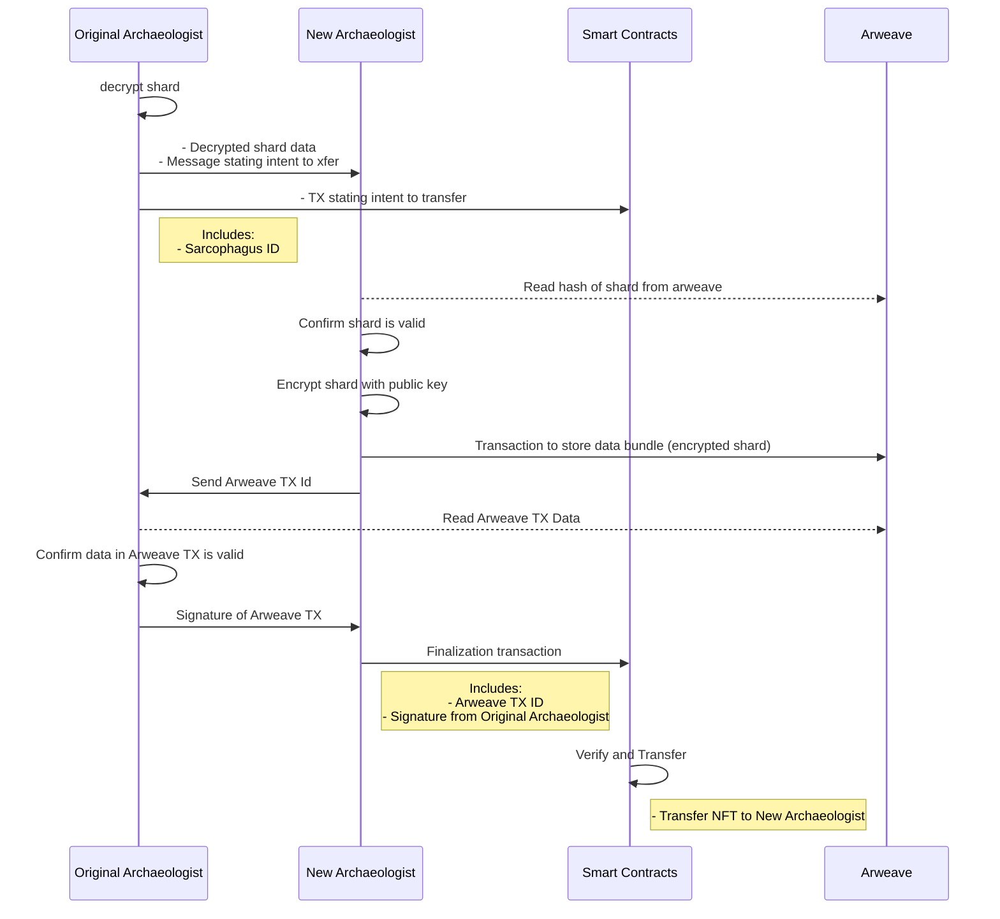

```mermaid
sequenceDiagram
  participant Original Archaeologist
  participant New Archaeologist
  participant Smart Contracts
  participant Arweave

  Original Archaeologist->>Original Archaeologist: decrypt shard

  Original Archaeologist->>New Archaeologist: - Decrypted shard data<br/>- Message stating intent to xfer
  
  Original Archaeologist->>Smart Contracts: - TX stating intent to transfer
  
  Note right of Original Archaeologist: Includes:<br/>- Sarcophagus ID

  New Archaeologist-->>Arweave: Read hash of shard from arweave

  New Archaeologist->>New Archaeologist: Confirm shard is valid

  New Archaeologist->>New Archaeologist: Encrypt shard with public key

  New Archaeologist->>Arweave: Transaction to store data bundle (encrypted shard)

  New Archaeologist->>Original Archaeologist: Send Arweave TX Id
  
  Original Archaeologist-->>Arweave: Read Arweave TX Data
  
  Original Archaeologist->>Original Archaeologist: Confirm data in Arweave TX is valid
  
  Original Archaeologist->>New Archaeologist: Signature of Arweave TX

  New Archaeologist->>Smart Contracts: Finalization transaction

  Note right of New Archaeologist: Includes:<br/>- Arweave TX ID<br/>- Signature from Original Archaeologist

  Smart Contracts->>Smart Contracts: Verify and Transfer

  Note right of Smart Contracts: - Transfer NFT to New Archaeologist
```
