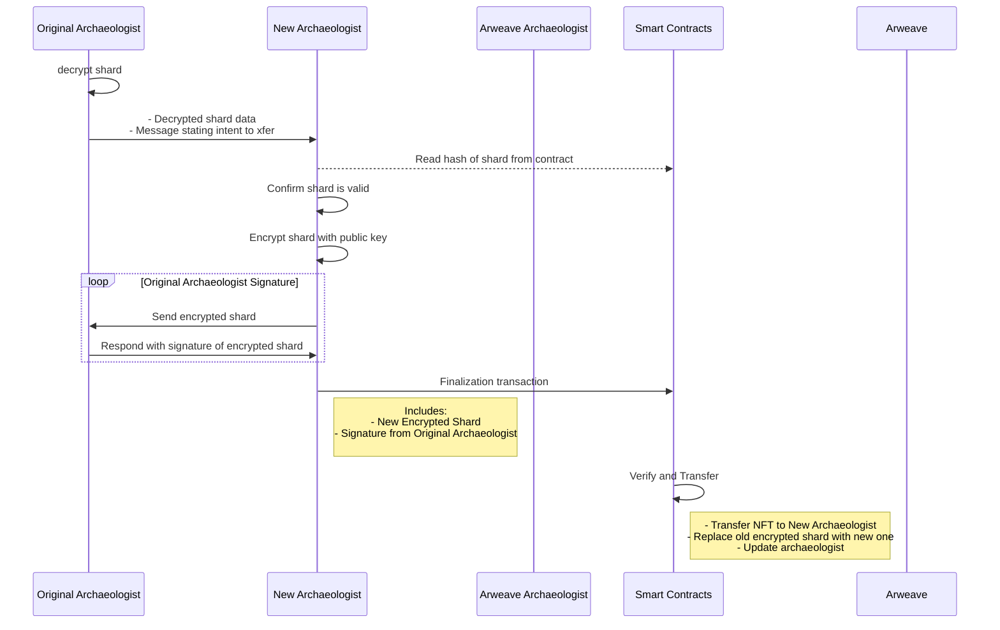

```mermaid
sequenceDiagram
  participant Original Archaeologist
  participant New Archaeologist
  participant Arweave Archaeologist
  participant Smart Contracts
  participant Arweave

  Original Archaeologist->>Original Archaeologist: decrypt shard

  Original Archaeologist->>New Archaeologist: - Decrypted shard data<br/>- Message stating intent to xfer

  New Archaeologist-->>Smart Contracts: Read hash of shard from contract

  New Archaeologist->>New Archaeologist: Confirm shard is valid

  New Archaeologist->>New Archaeologist: Encrypt shard with public key

  loop Original Archaeologist Signature
    New Archaeologist->>Original Archaeologist: Send encrypted shard

    Original Archaeologist->>New Archaeologist: Respond with signature of encrypted shard
  end

  New Archaeologist->>Smart Contracts: Finalization transaction

  Note right of New Archaeologist: Includes:<br/>- New Encrypted Shard<br/>- Signature from Original Archaeologist<br/>

  Smart Contracts->>Smart Contracts: Verify and Transfer

  Note right of Smart Contracts: - Transfer NFT to New Archaeologist <br>- Replace old encrypted shard with new one <br>- Update archaeologist
```
