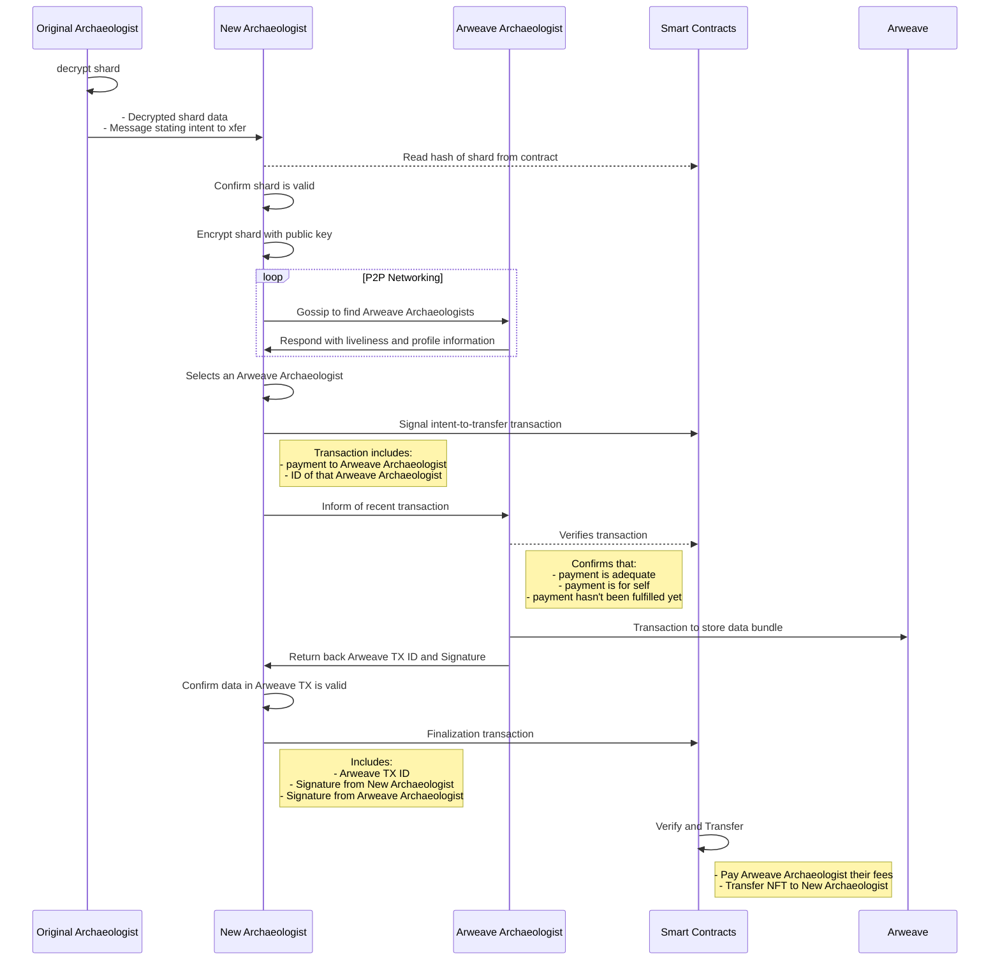

```mermaid
sequenceDiagram
  participant Original Archaeologist
  participant New Archaeologist
  participant Arweave Archaeologist
  participant Smart Contracts
  participant Arweave

  Original Archaeologist->>Original Archaeologist: decrypt shard

  Original Archaeologist->>New Archaeologist: - Decrypted shard data<br/>- Message stating intent to xfer

  New Archaeologist-->>Smart Contracts: Read hash of shard from contract

  New Archaeologist->>New Archaeologist: Confirm shard is valid

  New Archaeologist->>New Archaeologist: Encrypt shard with public key

  loop P2P Networking
    New Archaeologist->>Arweave Archaeologist: Gossip to find Arweave Archaeologists

    Arweave Archaeologist->>New Archaeologist: Respond with liveliness and profile information
  end

  New Archaeologist->>New Archaeologist: Selects an Arweave Archaeologist

  New Archaeologist->>Smart Contracts: Signal intent-to-transfer transaction

  Note right of New Archaeologist: Transaction includes:<br/>- payment to Arweave Archaeologist<br/>- ID of that Arweave Archaeologist

  New Archaeologist->>Arweave Archaeologist: Inform of recent transaction

  Arweave Archaeologist-->>Smart Contracts: Verifies transaction

  Note right of Arweave Archaeologist: Confirms that:<br/>- payment is adequate<br/>- payment is for self<br/>- payment hasn't been fulfilled yet

  Arweave Archaeologist->>Arweave: Transaction to store data bundle

  Arweave Archaeologist->> New Archaeologist: Return back Arweave TX ID and Signature

  New Archaeologist->>New Archaeologist: Confirm data in Arweave TX is valid

  New Archaeologist->>Smart Contracts: Finalization transaction

  Note right of New Archaeologist: Includes:<br/>- Arweave TX ID<br/>- Signature from New Archaeologist<br/>- Signature from Arweave Archaeologist

  Smart Contracts->>Smart Contracts: Verify and Transfer

  Note right of Smart Contracts: - Pay Arweave Archaeologist their fees<br/>- Transfer NFT to New Archaeologist
```
