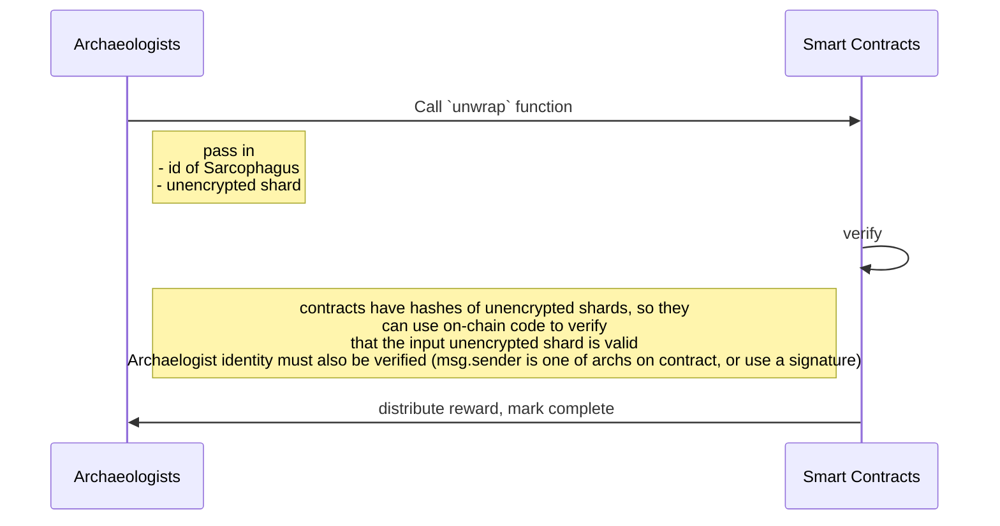

```mermaid
sequenceDiagram
  participant Archaeologists
  participant Smart Contracts

  Archaeologists->>Smart Contracts: Call `unwrap` function

  Note right of Archaeologists: pass in<br/>- id of Sarcophagus<br/>- unencrypted shard

  Smart Contracts->>Smart Contracts: verify

  Note left of Smart Contracts: contracts have hashes of unencrypted shards, so they<br/> can use on-chain code to verify<br/>that the input unencrypted shard is valid <br /> Archaelogist identity must also be verified (msg.sender is one of archs on contract, or use a signature)

  Smart Contracts->>Archaeologists: distribute reward, mark complete
```
