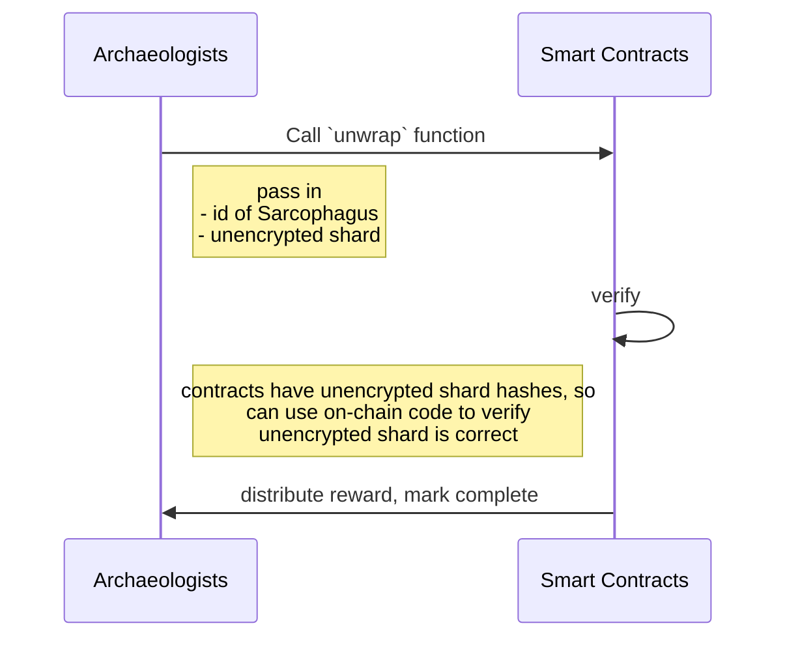

```mermaid
sequenceDiagram
  participant Archaeologists
  participant Smart Contracts

  Archaeologists->>Smart Contracts: Call `unwrap` function

  Note right of Archaeologists: pass in<br/>- id of Sarcophagus<br/>- unencrypted shard

  Smart Contracts->>Smart Contracts: verify

  Note left of Smart Contracts: contracts have unencrypted shard hashes, so<br/> can use on-chain code to verify<br/>unencrypted shard is correct

  Smart Contracts->>Archaeologists: distribute reward, mark complete
```
