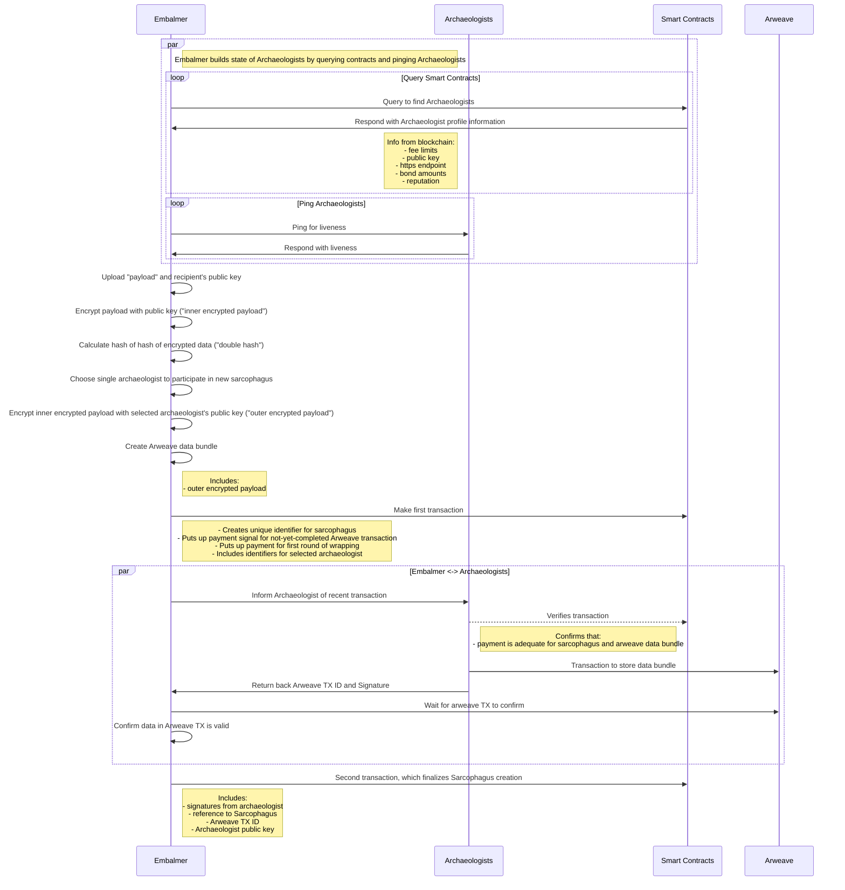

```mermaid
sequenceDiagram
  participant Embalmer
  participant Archaeologists
  participant Smart Contracts
  participant Arweave

  par
    Note right of Embalmer: Embalmer builds state of Archaeologists by querying contracts and pinging Archaeologists

    loop Query Smart Contracts
      Embalmer->>Smart Contracts: Query to find Archaeologists

      Smart Contracts->>Embalmer: Respond with Archaeologist profile information

      Note left of Archaeologists: Info from blockchain:<br/>- fee limits<br/>- public key <br/>- https endpoint <br/>- bond amounts<br/>- reputation
    end
    
   loop Ping Archaeologists
      Embalmer->>Archaeologists: Ping for liveness

      Archaeologists->>Embalmer: Respond with liveness
    end
  end

  Embalmer->>Embalmer: Upload "payload" and recipient's public key

  Embalmer->>Embalmer: Encrypt payload with public key ("inner encrypted payload")

  Embalmer->>Embalmer: Calculate hash of hash of encrypted data ("double hash")

  Embalmer->>Embalmer: Choose single archaeologist to participate in new sarcophagus

  Embalmer->>Embalmer: Encrypt inner encrypted payload with selected archaeologist's public key ("outer encrypted payload")

  Embalmer->>Embalmer: Create Arweave data bundle

  Note right of Embalmer: Includes:<br/>- outer encrypted payload

  Embalmer->>Smart Contracts: Make first transaction

  Note right of Embalmer:- Creates unique identifier for sarcophagus<br/>- Puts up payment signal for not-yet-completed Arweave transaction<br/>- Puts up payment for first round of wrapping<br/>- Includes identifiers for selected archaeologist

  par Embalmer <-> Archaeologists
    Embalmer->>Archaeologists: Inform Archaeologist of recent transaction

    Archaeologists-->>Smart Contracts: Verifies transaction

    Note right of Archaeologists: Confirms that:<br/>- payment is adequate for sarcophagus and arweave data bundle

    Archaeologists->>Arweave: Transaction to store data bundle

    Archaeologists->>Embalmer: Return back Arweave TX ID and Signature
    
    Embalmer->>Arweave: Wait for arweave TX to confirm

    Embalmer->>Embalmer: Confirm data in Arweave TX is valid
  end

  Embalmer->>Smart Contracts: Second transaction, which finalizes Sarcophagus creation

  Note right of Embalmer: Includes:<br/>- signatures from archaeologist<br/>- reference to Sarcophagus<br/>- Arweave TX ID <br/>- Archaeologist public key
```
