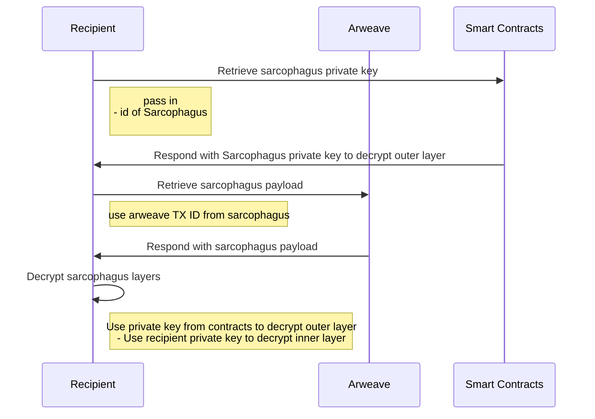

```mermaid
sequenceDiagram
  participant Recipient
  participant Arweave
  participant Smart Contracts

  Recipient->>Smart Contracts: Retrieve sarcophagus private key

  Note right of Recipient: pass in<br/>- id of Sarcophagus<br/>
  
  Smart Contracts->>Recipient: Respond with Sarcophagus private key to decrypt outer layer

  Recipient->>Arweave: Retrieve sarcophagus payload
  
  Note right of Recipient: use arweave TX ID from sarcophagus
    
  Arweave->>Recipient: Respond with sarcophagus payload
  
  Recipient->>Recipient: Decrypt sarcophagus layers

  Note right of Recipient: Use private key from contracts to decrypt outer layer <br/>- Use recipient private key to decrypt inner layer 
```